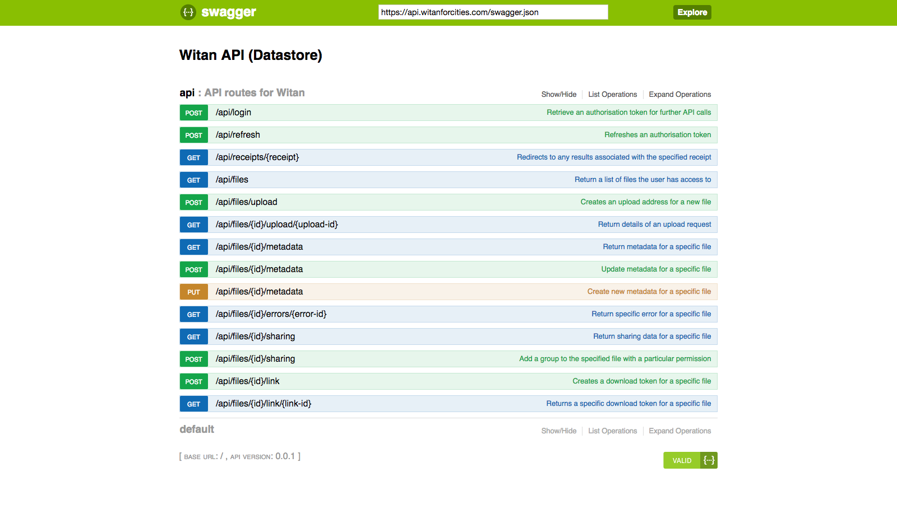

# Witan HTTP API Documentation

## How to inspect all the API endpoints with Swagger.

If you want a visual overview of the complete API reference then the Witan API is availble with a Swagger reference implementation. This will give you the opportunity to test out elements of the API without any programming. Swagger is interactive, meaning that you can test out API calls by filling in the fields provided. You will be required to login with your credentials before use as the authentication token is required in the other API calls.


### Example: Looking at the Swagger docs for the API.

```
https://api.witanforcities.com
```

When you visit the URL you will see the following screen. 



Clicking on the relevant API routes will expand into an information window where see the required fields and try out the API.

## How to check the API is healthy.

The healthcheck is a quick way to find out if the API endpoint is alive. If successful it will return `hello`.

### Example: Checking if the API is healthy.
```
curl -vvv -XGET https://api.witanforcities.com/healthcheck
```

### Example response: 

`hello`


## How to authenticate a user.

All calls to the API require authorisation based on your Witan login. You will receive an `auth-token` that will be used against subsequent API calls and a refresh token.

If the authorisation token is unused for longer than 30 minutes you will be required to refresh your token using the `/api/refresh` endpoint. For those interested in building a user interface that uses the Witan API then using the refresh token is the best way to keep your auth token alive. For those who are using code to call the API then it's assumed that you'll be using the login then use the auth token in subsequent calls.

### Example: User login to get authentication token

Using JSON the API expects the following payload. 

```
{"username":"yourloginemail@domain.com",
 "password":"your_password"}
```

The `curl` example below shows the payload being sent to the API.

```
curl -X POST --header 'Content-Type: application/json' --header 'Accept: application/json' -d '{"username":"yourloginemail@domain.com","password":"your_password"}' 'https://api.witanforcities.com/api/login'
```

### Example response

```
{"token-pair":
   {"auth-token":"eyJh..........VdbpA",
    "refresh-token":"eyJhb........sr4A"
   }
}
```


# Known Issues
